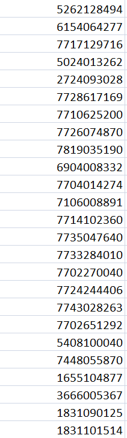
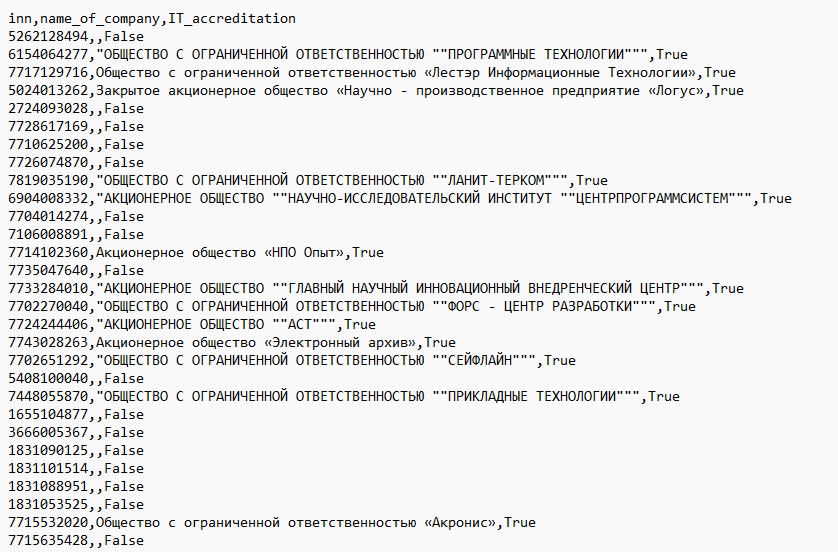

# Проект Selenium_python. Проверка it-аккредитации компаний
## Оглавление 

## Оглавление  
[1. Описание проекта](README.md#Описание-проекта)  
[2. Какой кейс решаем?](README.md#Какой-кейс-решаем)  
[3. Библиотеки](README.md#Библиотеки)  
[4. Краткая информация о данных](README.md#Краткая-информация-о-данных)  
[5. Этапы работы программы](README.md#Этапы-работы-программы)    
[6. Результаты](README.md#Результатыы)  
[7. Выводы](README.md#Выводы) 

### Описание проекта    
олучить информицию о статусе аккредитации it-компаний из сайта "Госуслуги" (https://www.gosuslugi.ru/itorgs) 

### Какой кейс решаем?
Использование методов http-запросов не дал нужного результата. Слишком долгая проверка одной ИНН и быстрая блокировка IP. 
Поэтому было решено использовать Python и Selenium

### Библиотеки
В данном проекте использовались библиотеки:
- Logging
- Time
- Pandas
- Numpy
- Selenium

### Краткая информация о данных

В качестве входных данных выступают ИНН компаний в ['.csv'-файл](inn_org\inn_org.csv) с ИНН организаций

### Этапы работы программы
<ol>
    <li>ИНН организации извлекаются из ".csv"-файла;</li>
    <li>Каждый из номеров проверяется на сайте (selenium);</li><ol>
            <li>Открывается сайт "Госуслуг"</li>
            <li>В поле вводится ИНН организация</li>
            <li>Результат работы сайта записывает в DataFrame (pandas) </li>
            <li>Очищается поле ввода</li>
        </ol>
    <li>Записать результат в ".csv" файл.</li>
</ol>

### Результаты:

Файл log_for_work.log. Лог-файл работы скрипта (отслеживание статуса выполнения)

Файл с результатом работы Result_work_selenium.csv состоящий из:
       <li>Колонка 1: inn - Идентификационный номер налогоплательщика компании</li>
       <li>Колонка 2: name_of_company - Наименование компании</li>
       <li>Колонка 3: IT_accreditation - Статус аккредитации-</li>

### Выводы 
Программа отрабатывает корректно и дсотаточно быстро.
Все ИНН были проверины и пошли дальше в работу. 
 С результато работы можете ознакомится в [файле](inn_org/inn_org.csv) 

Если информация по этому проекту покажется вам интересной или полезной, то я буду очень вам благодарен, если отметите репозиторий и профиль ⭐️⭐️⭐️-дами